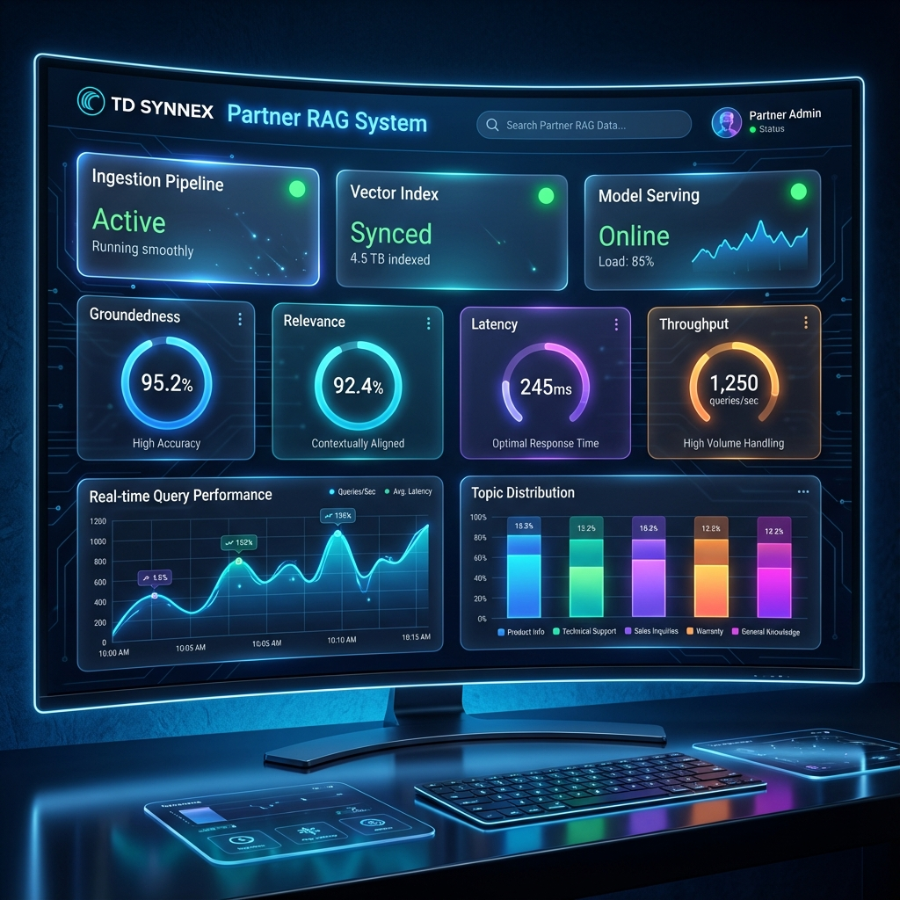
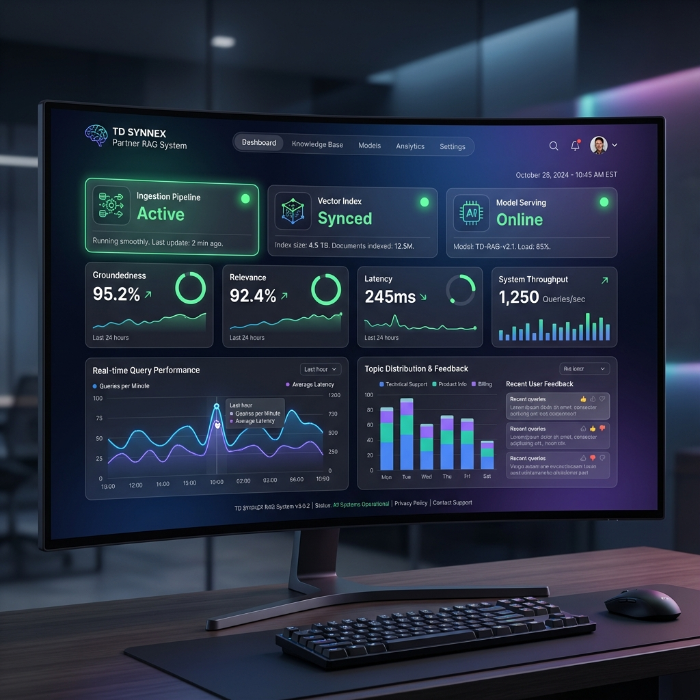
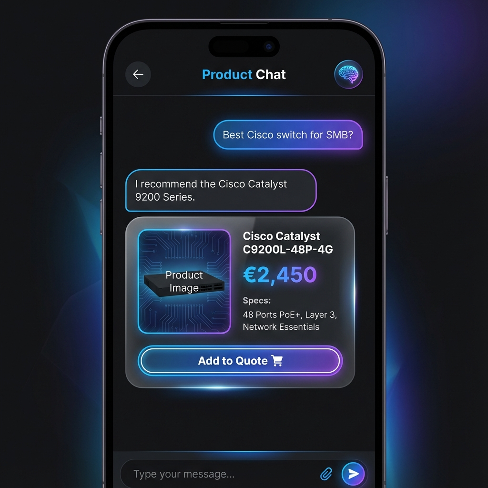
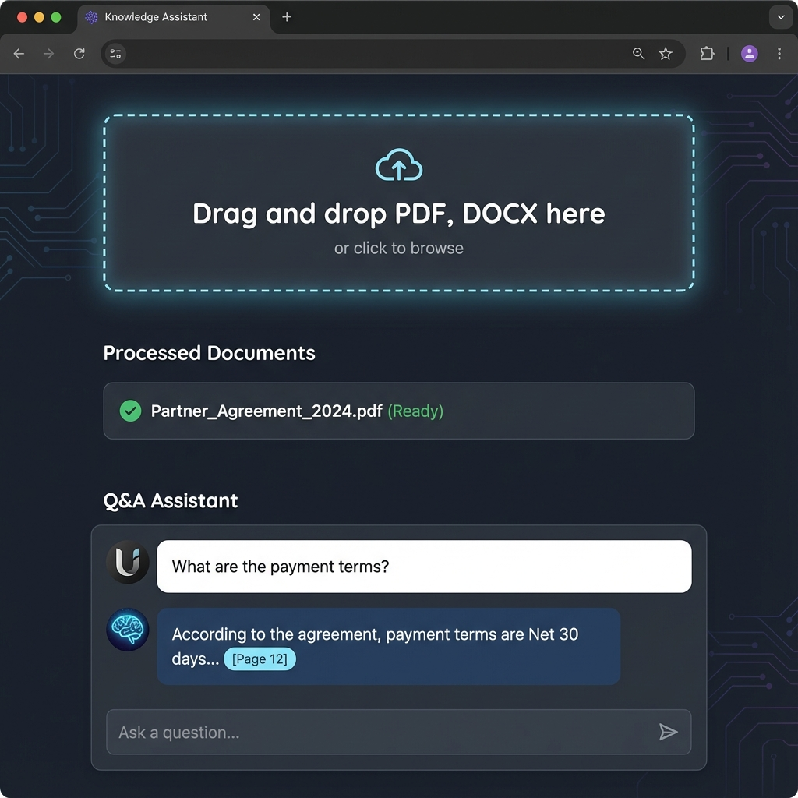

# TD SYNNEX Partner RAG System (Databricks & Azure)

A production-ready RAG Agent system demonstrating the power of **Azure Databricks**, **Vector Search**, and **GenAI** for the TD SYNNEX partner ecosystem. This project showcases how to build a scalable, secure, and intelligent product recommendation and knowledge assistant.

## 🚀 Live Demo
[**Click here to Launch App**](https://td-synnex-rag-ai-demo-v2.streamlit.app/)

## 📸 Dashboard & UI Preview

### 1. AI Command Center (Concept)
A futuristic "Single Pane of Glass" for monitoring ingestion, vector indexing, and Model Serving performance.

  

### 2. Partner Dashboard
Real-time metrics on Groundedness, Relevance, and System Latency.

  

### 3. Product Chat Agent
Sales-focused interface for querying the 5,000+ item EU catalog (Cisco, HP, Dell).

  

### 4. RAG Knowledge Assistant
Upload contracts, PDFs, or datasheets and ask complex questions with source attribution.

  

---

## 🏗️ Architecture

Built on **Azure Databricks** using **Unity Catalog** for governance and **MLflow** for lineage.

  

## 🛠️ Key Technologies
*   **Databricks Model Serving**: High-throughput LLM endpoint.
*   **FAISS & Sentence-Transformers**: Local vector search prototype (scalable to Vector Search).
*   **LangChain**: Orchestration of RAG workflows.
*   **Streamlit**: Frontend UI.
*   **Delta Lake**: Storage for logs, feedback, and document chunks.